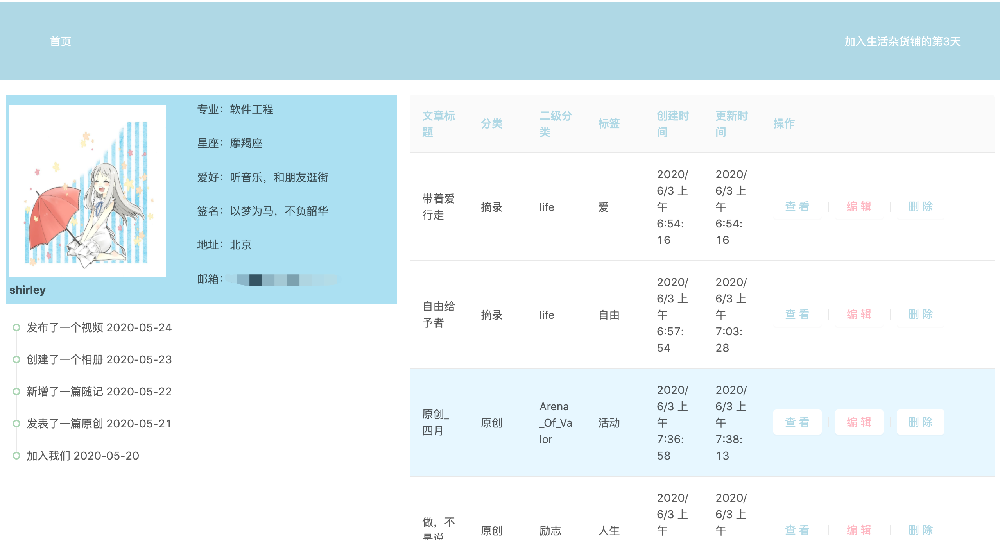
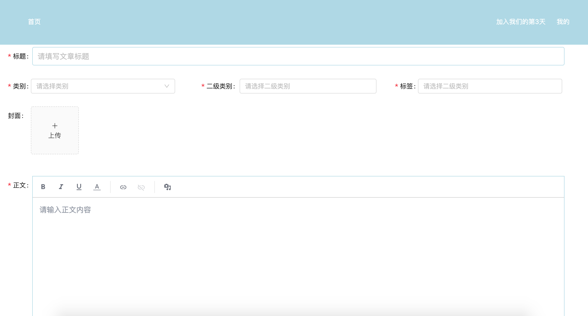
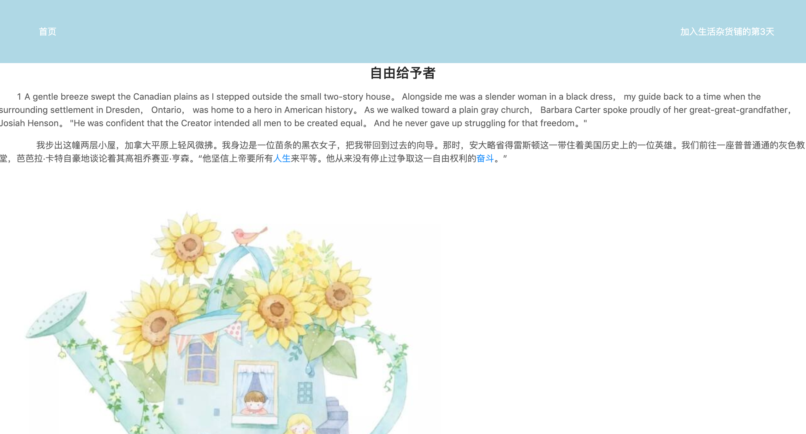

# growing-groceries
基于umi+dva+antd 创建的生活杂货铺（growing-groceries）
用于一个随时记录和分享的笔记使用

## 创建项目
### 使用umi快速搭建一个脚手架
```bash
yarn create umi growing-groceries
```
### 选择模板类型
    app
### What functionality do you want to enable?(Press <space> to select, <a> to toggle all, <i> to invert selection)
    选中antd, dva

### 和git上的项目绑定
    git remote add origin 仓库地址

## 准备运行

```bash
yarn install
```

```bash
yarn start
```

### 安装支持的插件

```bash
yarn add react-cookies
```
### 图片





## 联系方式
GitHub:  https://github.com/wxqSnowing